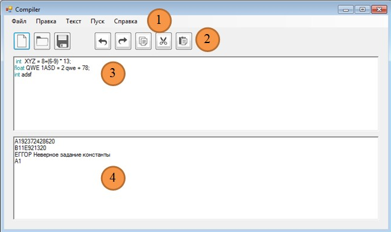
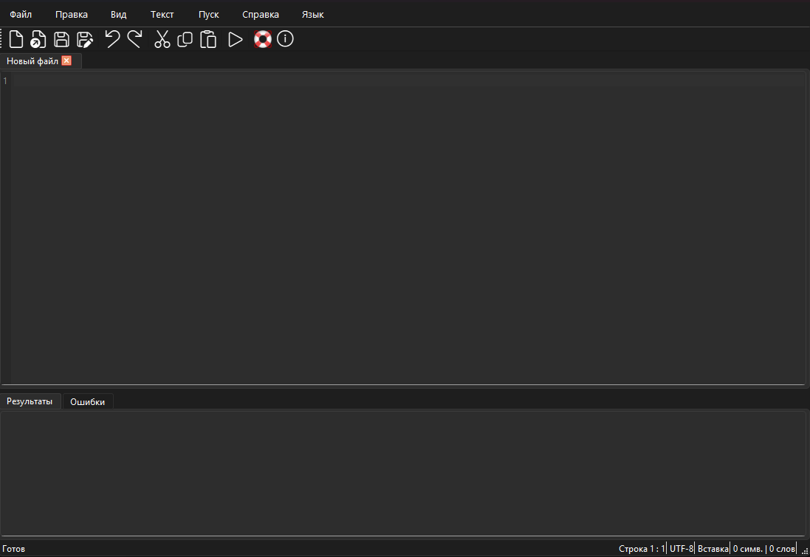
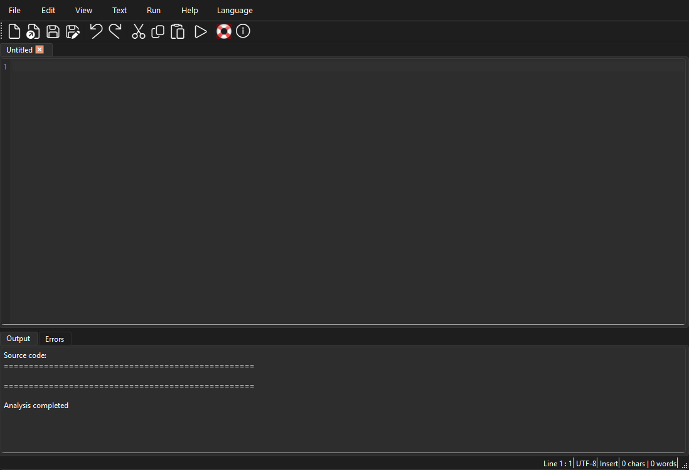
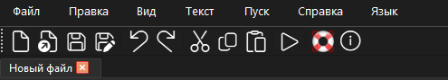
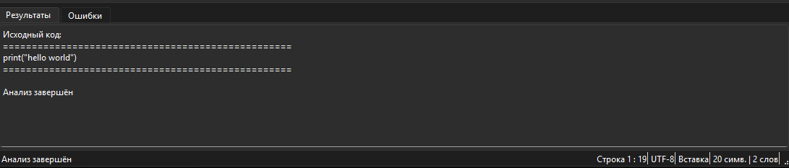
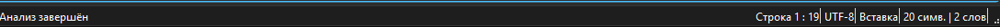
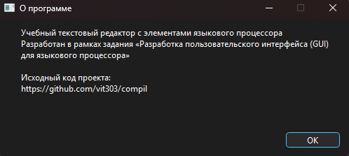

# Разработка пользовательского интерфейса (GUI) для языкового процессора

**Учебная работа**  
**Тема:** Разработка приложения – текстовый редактор с графическим интерфейсом пользователя (GUI).  
В дальнейшем приложение будет дополнено функциями языкового процессора (лексический и синтаксический анализатор).

**Язык реализации:** Python + PyQt6  
**Дата:** февраль 2026

## Цель работы

Разработать приложение — текстовый редактор с графическим интерфейсом.  
Приложение должно содержать:

1. Основное меню программы  
2. Панель инструментов  
3. Окно/область ввода и редактирования текста  
4. Окно/область отображения результатов работы языкового процессора (ввод текста в этой области запрещён)

## Соответствие заданию

Интерфейс полностью соответствует приведённому в задании примеру:



На рисунке обозначены:  
① — основное меню программы  
② — панель инструментов  
③ — область ввода/редактирования текста  
④ — область отображения результатов (ввод запрещён)

### Основное меню (①)

- **Файл** — Создать, Открыть, Сохранить, Сохранить как, Выход  
- **Правка** — Отменить, Повторить, Вырезать, Копировать, Вставить  
- **Вид** — Увеличить шрифт, Уменьшить шрифт  
- **Текст** — Постановка задачи, Грамматика, Классификация грамматики, Методология анализа, Тестовый пример, Список литературы, Исходный код программы  
- **Пуск** — Запуск синтаксического анализатора  
- **Справка** — Справка, О программе  
- **Язык** — Русский / English (дополнительная функция локализации)

### Панель инструментов (②)

Панель содержит кнопки для вызова часто используемых пунктов меню (все 11 пунктов из задания реализованы):

1. Создание документа  
2. Открытие документа  
3. Сохранение текущих изменений в документе  
4. Отмена изменений (Undo)  
5. Повтор последнего изменения (Redo)  
6. Копировать текстовый фрагмент  
7. Вырезать текстовый фрагмент  
8. Вставить текстовый фрагмент  
9. Запуск синтаксического анализатора  
10. Вызов справки — руководства пользователя  
11. Вызов информации о программе


### Область редактирования текста (③)

- Многовкладочный редактор  
- Нумерация строк  
- Подсветка синтаксиса (ключевые слова, строки, комментарии, числа)  
- Подсветка текущей строки  
- Масштабирование шрифта (Ctrl + колесо / Ctrl++ / Ctrl+-)  
- Поддержка Drag & Drop файлов  
- Undo / Redo / Cut / Copy / Paste

### Область результатов (④)

- Две вкладки:  
  • **Результаты** — текстовый вывод (preview кода, сообщения)  
  • **Ошибки** — таблица (Строка | Позиция | Сообщение)  
- В демо-режиме выводятся примеры ошибок  
- Ввод текста запрещён

## Реализованные дополнительные возможности

- Локализация интерфейса (русский / английский)  
- Статусная строка: позиция курсора, кодировка (UTF-8), режим (Вставка/Замена), кол-во символов и слов  
- Подтверждение сохранения при закрытии изменённых вкладок  
- Сплиттер для изменения размеров областей  
- Автоматическая адаптация при изменении размера окна

## Скриншоты реализованного приложения

### Главное окно (русский язык)



### Главное окно (английский язык)



### Панель инструментов и меню



### Область результатов и ошибок



### Статусная строка



### Диалог «О программе»



## Установка и запуск

### Требования

- Python 3.8+  
- PyQt6

```bash
pip install PyQt6

## Горячие клавиши

| Действие                  | Комбинация       |
|---------------------------|------------------|
| Новый файл                | Ctrl+N          |
| Открыть                   | Ctrl+O          |
| Сохранить                 | Ctrl+S          |
| Сохранить как             | Ctrl+Shift+S    |
| Отменить                  | Ctrl+Z          |
| Повторить                 | Ctrl+Y          |
| Вырезать                  | Ctrl+X          |
| Копировать                | Ctrl+C          |
| Вставить                  | Ctrl+V          |
| Запустить анализ          | F5              |
| Увеличить шрифт           | Ctrl++          |
| Уменьшить шрифт           | Ctrl+-          |

## Структура проекта

```text
.
├── main.py                     # точка входа
├── app/
│   ├── __init__.py
│   ├── main_window.py          # главное окно, меню, тулбар, статусбар
│   ├── editor_tab.py           # редактор + нумерация строк
│   ├── output_tab.py           # вкладки Результаты и Ошибки
│   ├── syntax_highlighter.py   # подсветка синтаксиса
│   ├── dialogs.py              # диалоги
│   └── i18n.py                 # локализация
└── screenshots/                # скриншоты