# Разработка пользовательского интерфейса (GUI) для языкового процессора

**Учебная работа**  
**Тема:** Разработка приложения – текстовый редактор с графическим интерфейсом пользователя (GUI).  
Дополнено функциями языкового процессора (лексический и синтаксический анализатор на основе **ANTLR 4.13.0**).

**Язык реализации:** Python + PyQt6  
**Генератор кода:** ANTLR 4.13.0  
**Дата последнего обновления:** март 2026  

## 🎯 Цель работы

Разработать приложение — текстовый редактор с графическим интерфейсом, дополненный лексическим и синтаксическим анализаторами на базе **ANTLR** для анализа структур Rust.  
Приложение должно содержать:

1. Основное меню программы  
2. Панель инструментов  
3. Окно/область ввода и редактирования текста  
4. Окно/область отображения результатов работы языкового процессора (ввод текста в этой области запрещён)

## Соответствие заданию

Интерфейс полностью соответствует приведённому в задании примеру:

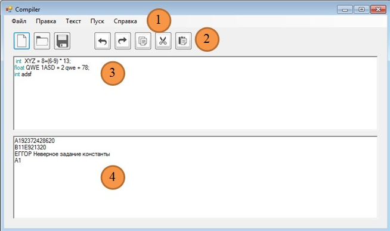

На рисунке обозначены:  
① — основное меню программы  
② — панель инструментов  
③ — область ввода/редактирования текста  
④ — область отображения результатов (ввод запрещён)

### Основное меню (①)

- **Файл** — Создать, Открыть, Сохранить, Сохранить как, Выход  
- **Правка** — Отменить, Повторить, Вырезать, Копировать, Вставить  
- **Вид** — Увеличить шрифт, Уменьшить шрифт  
- **Текст** — Постановка задачи, Грамматика, Классификация грамматики, Методология анализа, Тестовый пример, Список литературы, Исходный код программы  
- **Пуск** — Запуск синтаксического анализатора  
- **Справка** — Справка, О программе  
- **Язык** — Русский / English (дополнительная функция локализации)

### Панель инструментов (②)

Панель содержит кнопки для вызова часто используемых пунктов меню (все 11 пунктов из задания реализованы):

1. Создание документа  
2. Открытие документа  
3. Сохранение текущих изменений в документе  
4. Отмена изменений (Undo)  
5. Повтор последнего изменения (Redo)  
6. Копировать текстовый фрагмент  
7. Вырезать текстовый фрагмент  
8. Вставить текстовый фрагмент  
9. Запуск синтаксического анализатора  
10. Вызов справки — руководства пользователя  
11. Вызов информации о программе


### Область редактирования текста (③)

- Многовкладочный редактор  
- Нумерация строк  
- Подсветка синтаксиса (ключевые слова, строки, комментарии, числа)  
- Подсветка текущей строки  
- Масштабирование шрифта (Ctrl + колесо / Ctrl++ / Ctrl+-)  
- Поддержка Drag & Drop файлов  
- Undo / Redo / Cut / Copy / Paste

### Область результатов (④)

- Две вкладки:  
  • **Результаты** — текстовый вывод (preview кода, сообщения)  
  • **Ошибки** — таблица (Строка | Позиция | Сообщение)  
- В демо-режиме выводятся примеры ошибок  
- Ввод текста запрещён

## Реализованные дополнительные возможности

- Локализация интерфейса (русский / английский)  
- Статусная строка: позиция курсора, кодировка (UTF-8), режим (Вставка/Замена), кол-во символов и слов  
- Подтверждение сохранения при закрытии изменённых вкладок  
- Сплиттер для изменения размеров областей  
- Автоматическая адаптация при изменении размера окна

## ANTLR интеграция

### Грамматики ANTLR

Проект использует **ANTLR 4.13.0** для автоматической генерации лексера и парсера:

**Файлы грамматики:**
- `RustLexer.g4` — лексическая грамматика для Rust
- `RustParser.g4` — синтаксическая грамматика для Rust

**Сгенерированные файлы:**
- `app/RustLexer.py` — лексер (сгенерирован ANTLR)
- `app/RustParser.py` — парсер (сгенерирован ANTLR)
- `app/RustParserVisitor.py` — visitor для обхода дерева (сгенерирован ANTLR)

**Команды генерации:**
```bash
antlr4 -Dlanguage=Python3 -visitor -no-listener RustLexer.g4
antlr4 -Dlanguage=Python3 -visitor -no-listener RustParser.g4
```

### Анализ кода

Анализатор синтаксиса использует ANTLR для разбора Rust структур:

```python
from app.syntax_analyzer import SyntaxAnalyzer

analyzer = SyntaxAnalyzer()
errors = analyzer.analyze(rust_code)
```
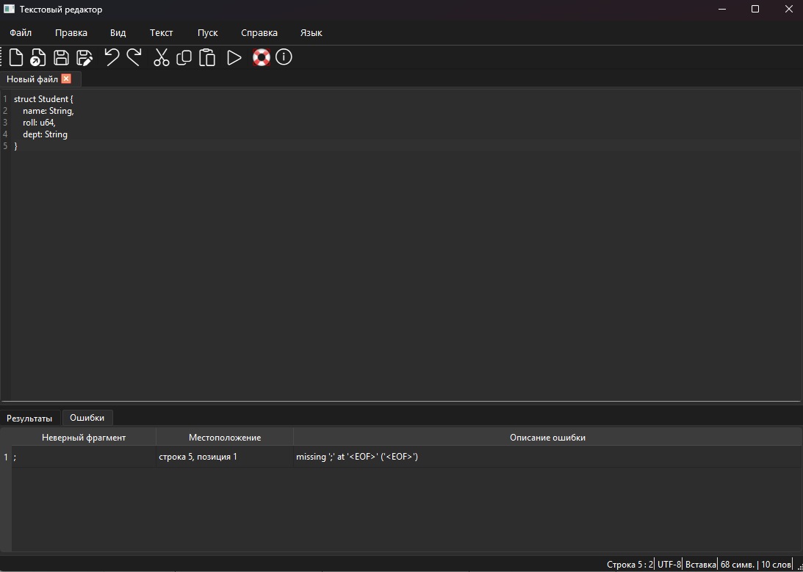

## Скриншоты реализованного приложения

### Главное окно (русский язык)

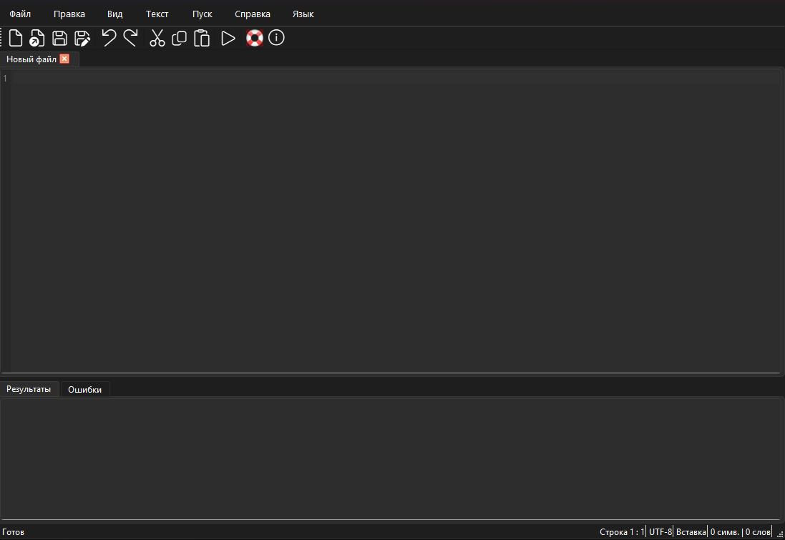

### Главное окно (английский язык)

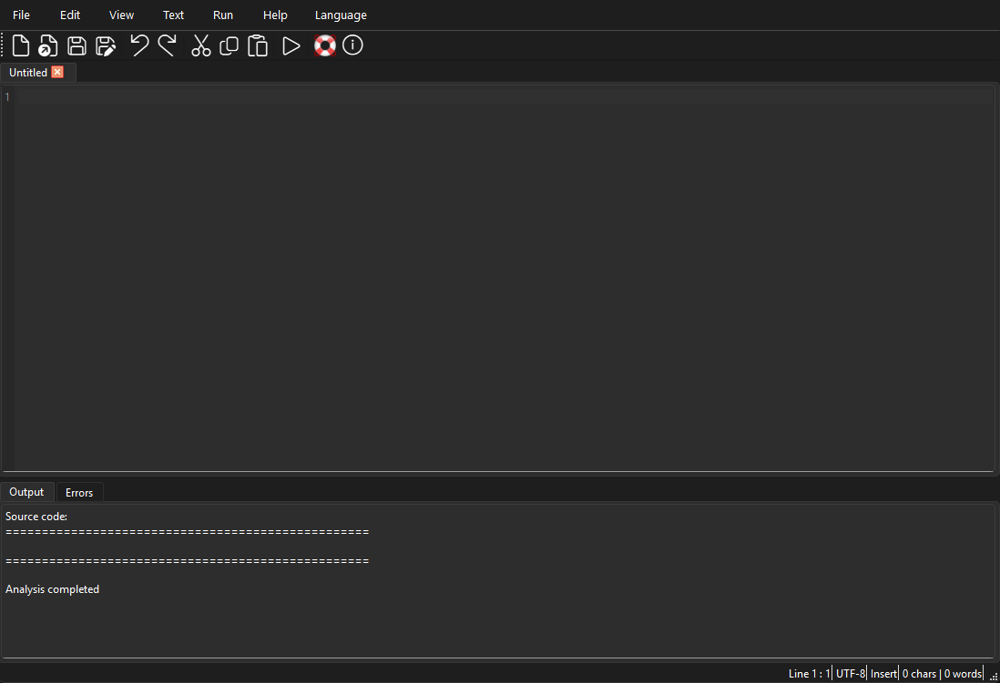

### Панель инструментов и меню

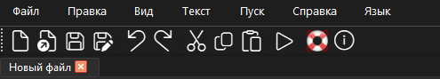

### Область результатов и ошибок

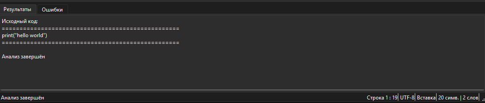

### Статусная строка

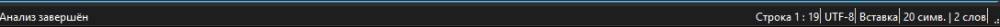

### Диалог «О программе»

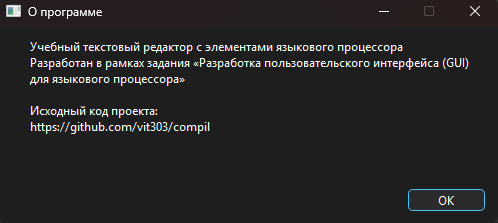

## Установка и запуск

### Требования

- Python 3.8+  
- PyQt6
- antlr4-python3-runtime (для выполнения ANTLR-сгенерированного кода)
- ANTLR 4.13.0 (только для генерации кода из грамматик, не требуется для запуска)

### Установка зависимостей

```bash
pip install PyQt6 antlr4-python3-runtime
```

### Запуск

```bash
python main.py
```

## Горячие клавиши

| Действие                  | Комбинация       |
|---------------------------|------------------|
| Новый файл                | Ctrl+N          |
| Открыть                   | Ctrl+O          |
| Сохранить                 | Ctrl+S          |
| Сохранить как             | Ctrl+Shift+S    |
| Отменить                  | Ctrl+Z          |
| Повторить                 | Ctrl+Y          |
| Вырезать                  | Ctrl+X          |
| Копировать                | Ctrl+C          |
| Вставить                  | Ctrl+V          |
| Запустить анализ          | F5              |
| Увеличить шрифт           | Ctrl++          |
| Уменьшить шрифт           | Ctrl+-          |

## Структура проекта

\```
.
├── main.py                     # точка входа
├── app/
│   ├── __init__.py
│   ├── main_window.py          # главное окно, меню, тулбар, статусбар
│   ├── editor_tab.py           # редактор + нумерация строк
│   ├── output_tab.py           # вкладки Результаты и Ошибки
│   ├── syntax_highlighter.py   # подсветка синтаксиса
│   ├── dialogs.py              # диалоги
│   └── i18n.py                 # локализация
└── screenshots/                # скриншоты

\```
Разработан лексический анализатор для структур в Rust (ключевые слова сужены под объявления `struct`).  
Синтаксический анализатор разбирает только объявления структур (`struct` / `pub struct`).  
Интегрирован в GUI из ЛР1.  
Вывод: таблица лексем ("Результаты") + таблица ошибок ("Ошибки").  
Навигация по ошибкам реализована.

### Допустимые лексемы
| Код | Тип лексемы     | Примеры                  |
|-----|-----------------|--------------------------|
| 14  | ключевое слово  | `struct`, `pub`, примитивы (`i32`, `u64`, `String`...) |
| 2   | идентификатор   | `Point`, `x`, `width`    |
| 1   | число           | `123`, `-4.5`            |
| 5   | строка          | `"hello"`, `'c'`         |
| 10  | оператор        | `=`, `->`, `+`, `==`     |
| 16  | разделитель     | `{`, `}`, `,`, `;`       |
| 11  | разделитель     | пробел, `\n`             |
| 8   | комментарий     | `// ...`, `/* ... */`    |

### Диаграмма состояний конечного автомата
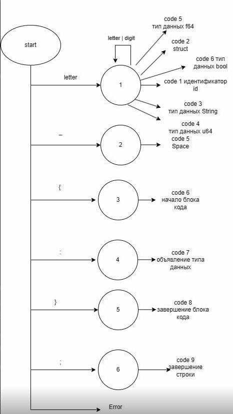  

Краткое описание: Автомат сканирует текст слева направо, накапливая лексемы. Многострочность учитывается через счётчик строк. Ошибки фиксируются в реальном времени.

### Тестовые примеры

#### 1. Корректный (однострочный)
**Вход:** `struct Point { x: i32, y: i32 }`

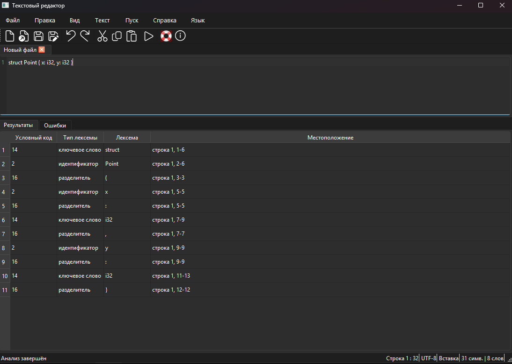

#### 2. С ошибкой
**Вход:** `struct Point { x: i32@ }`  
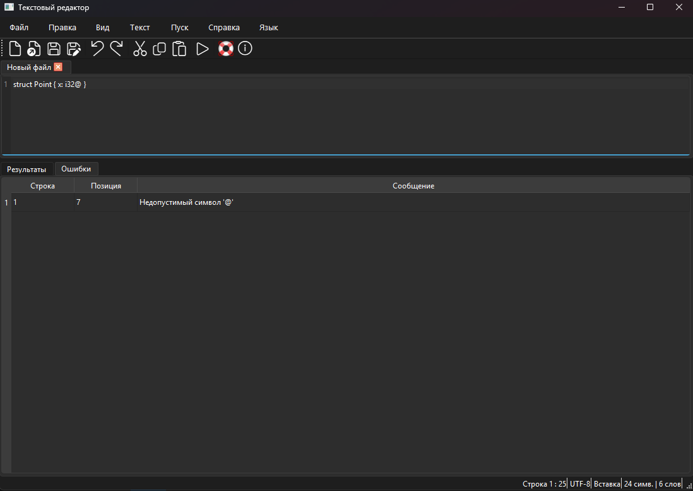

