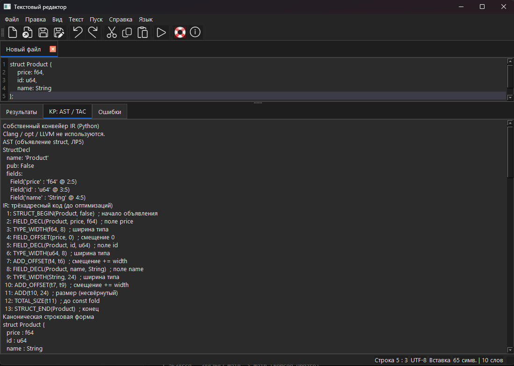
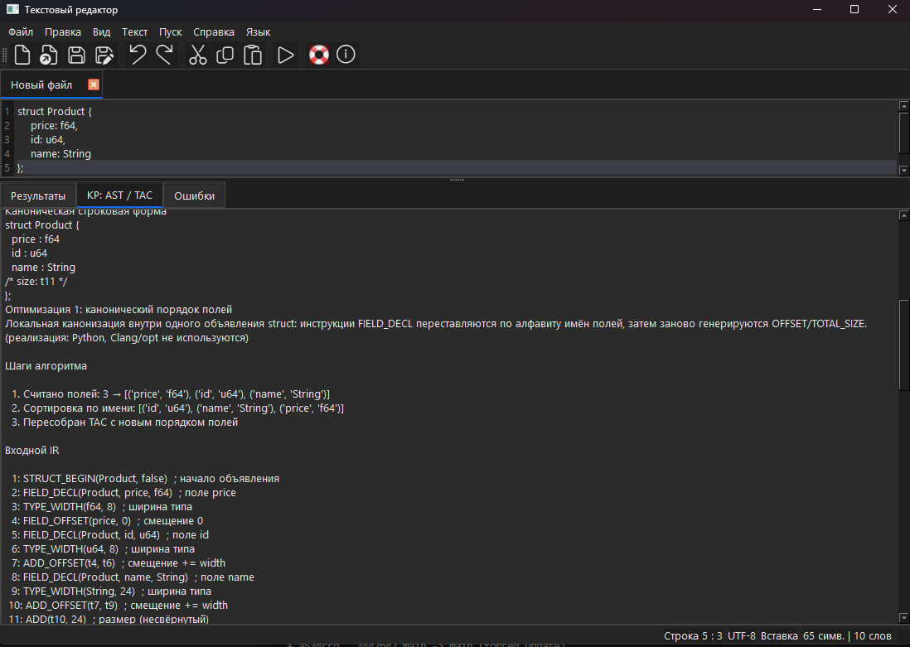
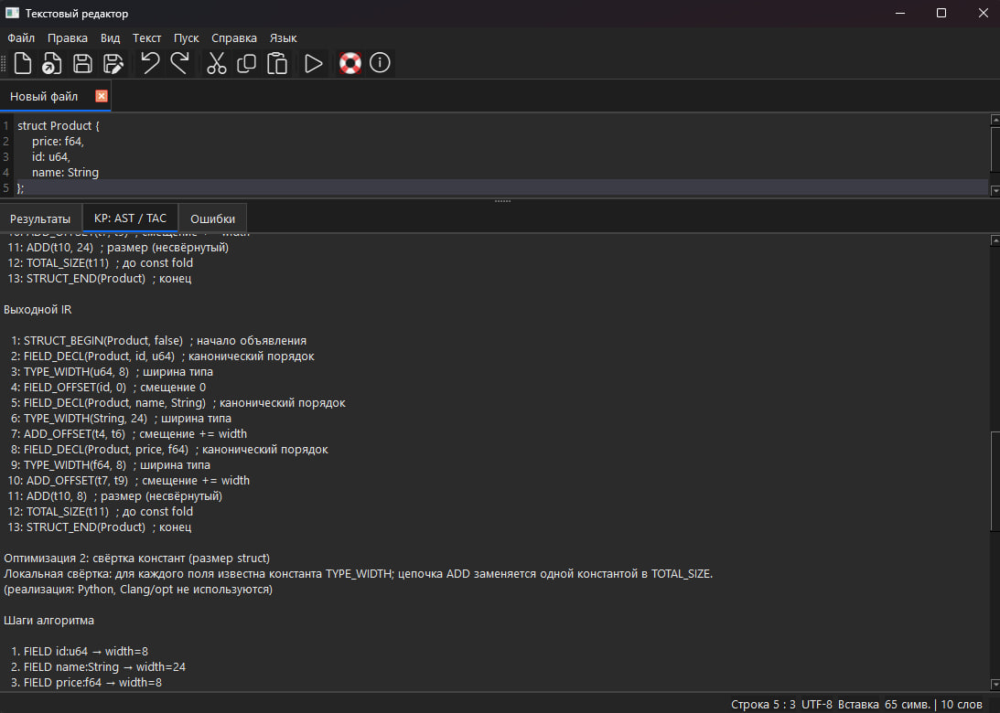
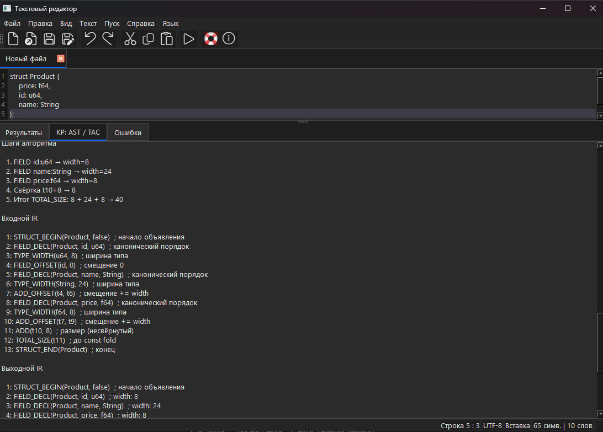
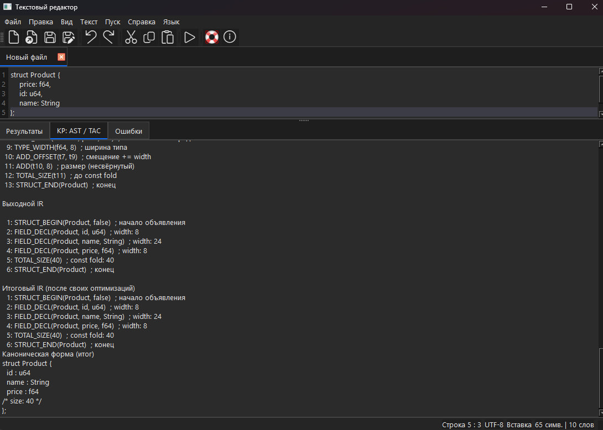

# compil — Formal Languages and Compilers (учебный языковой процессор)

## Содержание

- [Лабораторная работа 1 — GUI](#lab-1)
- [Лабораторная работа 2 — лексический анализатор](#lab-2)
- [Лабораторная работа 3 — синтаксический анализатор](#lab-3)
- [Лабораторная работа 7 — AST, IR и оптимизации](#lab-7)

---

<a id="lab-1"></a>

# Разработка пользовательского интерфейса (GUI) для языкового процессора

**Учебная работа**  
**Тема:** Разработка приложения – текстовый редактор с графическим интерфейсом пользователя (GUI).  
В дальнейшем приложение будет дополнено функциями языкового процессора (лексический и синтаксический анализатор).

**Язык реализации:** Python + PyQt6  
**Дата:** февраль 2026

## Цель работы

Разработать приложение — текстовый редактор с графическим интерфейсом.  
Приложение должно содержать:

1. Основное меню программы  
2. Панель инструментов  
3. Окно/область ввода и редактирования текста  
4. Окно/область отображения результатов работы языкового процессора (ввод текста в этой области запрещён)

## Соответствие заданию

Интерфейс полностью соответствует приведённому в задании примеру:


На рисунке обозначены:  
① — основное меню программы  
② — панель инструментов  
③ — область ввода/редактирования текста  
④ — область отображения результатов (ввод запрещён)

### Основное меню (①)

- **Файл** — Создать, Открыть, Сохранить, Сохранить как, Выход  
- **Правка** — Отменить, Повторить, Вырезать, Копировать, Вставить  
- **Вид** — Увеличить шрифт, Уменьшить шрифт  
- **Текст** — Постановка задачи, Грамматика, Классификация грамматики, Методология анализа, Тестовый пример, Список литературы, Исходный код программы  
- **Пуск** — Запуск синтаксического анализатора  
- **Справка** — Справка, О программе  
- **Язык** — Русский / English (дополнительная функция локализации)

### Панель инструментов (②)

Панель содержит кнопки для вызова часто используемых пунктов меню (все 11 пунктов из задания реализованы):

1. Создание документа  
2. Открытие документа  
3. Сохранение текущих изменений в документе  
4. Отмена изменений (Undo)  
5. Повтор последнего изменения (Redo)  
6. Копировать текстовый фрагмент  
7. Вырезать текстовый фрагмент  
8. Вставить текстовый фрагмент  
9. Запуск синтаксического анализатора  
10. Вызов справки — руководства пользователя  
11. Вызов информации о программе


### Область редактирования текста (③)

- Многовкладочный редактор  
- Нумерация строк  
- Подсветка синтаксиса (ключевые слова, строки, комментарии, числа)  
- Подсветка текущей строки  
- Масштабирование шрифта (Ctrl + колесо / Ctrl++ / Ctrl+-)  
- Поддержка Drag & Drop файлов  
- Undo / Redo / Cut / Copy / Paste

### Область результатов (④)

- Две вкладки:  
  • **Результаты** — текстовый вывод (preview кода, сообщения)  
  • **Ошибки** — таблица (Строка | Позиция | Сообщение)  
- В демо-режиме выводятся примеры ошибок  
- Ввод текста запрещён

## Реализованные дополнительные возможности

- Локализация интерфейса (русский / английский)  
- Статусная строка: позиция курсора, кодировка (UTF-8), режим (Вставка/Замена), кол-во символов и слов  
- Подтверждение сохранения при закрытии изменённых вкладок  
- Сплиттер для изменения размеров областей  
- Автоматическая адаптация при изменении размера окна

## Скриншоты реализованного приложения

### Главное окно (русский язык)


### Главное окно (английский язык)


### Панель инструментов и меню


### Область результатов и ошибок


### Статусная строка


### Диалог «О программе»


## Установка и запуск

### Требования

- Python 3.8+  
- PyQt6


pip install PyQt6

## Горячие клавиши

| Действие                  | Комбинация       |
|---------------------------|------------------|
| Новый файл                | Ctrl+N          |
| Открыть                   | Ctrl+O          |
| Сохранить                 | Ctrl+S          |
| Сохранить как             | Ctrl+Shift+S    |
| Отменить                  | Ctrl+Z          |
| Повторить                 | Ctrl+Y          |
| Вырезать                  | Ctrl+X          |
| Копировать                | Ctrl+C          |
| Вставить                  | Ctrl+V          |
| Запустить анализ          | F5              |
| Увеличить шрифт           | Ctrl++          |
| Уменьшить шрифт           | Ctrl+-          |

## Структура проекта

\```
.
├── main.py                     # точка входа
├── app/
│   ├── __init__.py
│   ├── main_window.py          # главное окно, меню, тулбар, статусбар
│   ├── editor_tab.py           # редактор + нумерация строк
│   ├── output_tab.py           # вкладки Результаты и Ошибки
│   ├── syntax_highlighter.py   # подсветка синтаксиса
│   ├── dialogs.py              # диалоги
│   └── i18n.py                 # локализация
└── screenshots/                # скриншоты

\```
<a id="lab-3"></a>

Разработан лексический анализатор для структур в Rust (ключевые слова сужены под объявления `struct`).  
Синтаксический анализатор разбирает только объявления структур (`struct` / `pub struct`).  
Интегрирован в GUI из ЛР1.  
Вывод: таблица лексем ("Результаты") + таблица ошибок ("Ошибки").  
Навигация по ошибкам реализована.

### Допустимые лексемы
| Код | Тип лексемы     | Примеры                  |
|-----|-----------------|--------------------------|
| 14  | ключевое слово  | `struct`, `pub`, примитивы (`i32`, `u64`, `String`...) |
| 2   | идентификатор   | `Point`, `x`, `width`    |
| 1   | число           | `123`, `-4.5`            |
| 5   | строка          | `"hello"`, `'c'`         |
| 10  | оператор        | `=`, `->`, `+`, `==`     |
| 16  | разделитель     | `{`, `}`, `,`, `;`       |
| 11  | разделитель     | пробел, `\n`             |
| 8   | комментарий     | `// ...`, `/* ... */`    |

### Диаграмма состояний конечного автомата
  

Краткое описание: Автомат сканирует текст слева направо, накапливая лексемы. Многострочность учитывается через счётчик строк. Ошибки фиксируются в реальном времени.

### Тестовые примеры

#### 1. Корректный (однострочный)
**Вход:** `struct Point { x: i32, y: i32 }`


#### 2. С ошибкой
**Вход:** `struct Point { x: i32@ }`  


## Синтаксический анализатор (парсер)

### Цель работы (ЛР3)

Изучить назначение и принципы работы синтаксического анализатора в структуре компилятора. Спроектировать грамматику для заданной синтаксической конструкции (объявление структуры в стиле Rust), построить схему метода анализа, выполнить программную реализацию парсера с нейтрализацией синтаксических ошибок методом Айронса. Интегрировать модуль в ранее созданный GUI.

### Постановка задачи (ЛР3)

- Разработать грамматику для объявления структуры (`struct`).
- Построить схему метода анализа (рекурсивный спуск / автоматная грамматика).
- Реализовать парсер с восстановлением после ошибок (метод Айронса).
- Входные данные — строка из области редактирования.
- Выходные данные:
  - При успехе: сообщение об отсутствии ошибок.
  - При ошибках: таблица с колонками *Неверный фрагмент*, *Местоположение (строка, позиция)*, *Описание ошибки*.
- Интеграция: кнопка «Пуск» (или отдельная кнопка) запускает синтаксический анализ.
- Навигация: клик по строке таблицы ошибок → курсор в редакторе устанавливается на позицию ошибки.

## Вариант задания 11
Объявление и определение структуры на языке Rust

Корректные примеры строк:

```
struct Student {
    name: String,
    roll: u64,
    dept: String
};

```

```
struct Point {
    x : f64,
    y : f64
};

```
```
struct Product {
    name: String,
    id: u64,
    price: f64,
    category: String,
    in_stock: bool
};
```
### Перечень допустимых лексем
```
struct, bool, char, str, String,
i8, i16, i32, i64, i128, isize,
u8, u16, u32, u64, u128, usize,
f32, f64
```

### Разработанная грамматика
```
1) <START> -> 'struct' <SPACE>
2) <SPACE> -> ' ' <NAME_STRUCT>
3) <NAME_STRUCT> -> letter <NAME_STRUCT_REM>
4) <NAME_STRUCT_REM> -> letter <NAME_STRUCT_REM> | digit <NAME_STRUCT_REM> | '_' <NAME_STRUCT_REM> | '{' <BODY>
5) <BODY> -> letter <ID>
6) <ID> -> letter <ID> | digit <ID> | '_' <ID> | ':' <TYPE>
7) <TYPE> -> 'String' <END_FIELD> | 'u64' <END_FIELD> | 'char' <END_FIELD> | 'f64' <END_FIELD> | 'bool' <END_FIELD>
8) <END_FIELD> -> ',' <BODY> | '}' <END_BODY>
9) <END_BODY> -> ';'
```

Следуя введенному формальному определению грамматики, представим G[‹START›] ее составляющими:

```
Z = ‹START ›;
VT = { a, b, c, ..., z, A, B, C, ..., Z, 0, 1, 2, ..., 9, _, {, }, :, ,, ;, _};
VN = {<START>, <SPACE>, <NAME_STRUCT>, <NAME_STRUCT_REM>, <BODY>, <ID>, <TYPE>, <END_FIELD>, <END_BODY>}.
```

Согласно классификации Хомского, грамматика G[‹START›] является автоматной.
Правила (1)-(9) относятся к классу праворекурсивных продукций (A → aB | a | ε)

### Граф автоматной грамматики


## Метод Айронса для автоматной грамматики

Разрабатываемый синтаксический анализатор построен на базе автоматной грамматики. Реализация алгоритма Айронса для автоматной грамматики имеет следующую особенность.
Дерево разбора с использованием автоматной грамматики представлено на рисунке.


Таким образом, при возникновении синтаксической ошибки в процессе разбора с использованием автоматной грамматики, в дереве разбора всегда будет только один недостроенный куст.


Поскольку единственный недостроенный куст – это тот, во время построения которого возникла синтаксическая ошибка, то это единственный куст, к которому можно привязать оставшуюся входную цепочку символов.
Алгоритм нейтрализации был сведен к последовательному удалению следующего символа во входной цепочке до тех пор, пока следующий символ не окажется одним из допустимых в данный момент разбора.


## Вариант задания (синтаксис)

**Конструкция:** объявление структуры в стиле Rust.

## Тесты


## Тест со множеством ошибок

### Правильный вариант


### Вариант с 10 ошибками


---

<a id="lab-7"></a>

# Лабораторная работа 7. Анализ и преобразование кода (собственный IR и оптимизации)

Текст и иллюстрации соответствуют отчёту [ЛАБА7.odt](ЛАБА7.odt).

## Сведения об авторе (ЛР 7)

- **ФИО:** Зоркольцев Илья Алексеевич  
- **Группа:** АВТ-313  
- **Год:** 2026  

## Цель работы

Познакомиться с построением AST и промежуточного представления (TAC), применить локальные оптимизации, проанализировать передачу структур в C и интегрировать все этапы в GUI языкового процессора (продолжение ЛР 1–5).

## Постановка задачи

**Общее задание:**

- Построить AST для программы на C/C++.  
- Сгенерировать промежуточное представление (TAC).  
- Применить оптимизации IR.  
- Проанализировать результат.  

**Индивидуальный вариант 2.2 — структуры / записи:**

Исследовать передачу `struct Point` в функцию `sum`; сравнить IR до и после оптимизаций.

Дополнительно (по методичке):

- Продемонстрировать входной и выходной IR для **каждой** из двух локальных оптимизаций.  
- Ответить на контрольные вопросы.  

## Используемые технологии

Python 3, PyQt6, собственные модули:

- `app/struct_ast.py` — AST объявления `struct` (Rust)  
- `app/struct_ir.py` — генерация TAC  
- `app/ir_passes.py` — локальные оптимизации  
- `app/c_struct_ir.py` — TAC для варианта C (`struct_pass.c`)  

**Clang и LLVM не используются** — оптимизации реализованы вручную на Python.

## Запуск

```bash
pip install -r requirements.txt
python main.py
```

| Действие | Результат |
|----------|-----------|
| **F5** — Rust `struct { ... }` | Лексика + синтаксис + вкладка **КР: AST / TAC** |
| **F5** / **F6** — `struct_pass.c` | Собственный TAC для C (передача struct) |
| **Пуск → Открыть пример struct (КР)** | `examples/kr/struct_bonus_demo.txt` |
| **Пуск → Открыть пример struct_pass.c** | `examples/lab7/struct_pass.c` |

Вкладки вывода: **Результаты** (лексемы), **КР: AST / TAC** (AST, IR, оптимизации), **Ошибки**.

---

## Общая часть

Пример `main.c` (функции `square` и `main`) находится в `examples/lab7/main.c`.  
Для варианта struct используется `examples/lab7/struct_pass.c`.

```c
#include <stdio.h>

int square(int x) {
    return x * x;
}

int main() {
    int a = 5;
    int b = square(a);
    printf("%d\n", b);
    return 0;
}
```

Для общей части в GUI демонстрируется **собственный** конвейер AST → TAC → оптимизации на примере объявления `struct` (скриншоты ниже).

---

## Дополнительное задание: AST, TAC и две локальные оптимизации

Конструкция из КР/ЛР5: объявление `struct` на языке Rust.  
Clang и LLVM не используются — реализация на Python.

**Тестовый пример:**

```
struct Product {
    price: f64,
    id: u64,
    name: String
};
```

**Рис. 1.** GUI: исходный код и вкладка «КР: AST / TAC» — AST и IR до оптимизаций.



**Рис. 2.** Оптимизация 1: канонический порядок полей — входной IR.



**Рис. 3.** Оптимизация 1: выходной IR после упорядочивания полей.



**Рис. 4.** Оптимизация 2: свёртка констант размера struct — входной и выходной IR.



**Рис. 5.** Итоговый IR и каноническая форма после обеих оптимизаций.



---

## Оптимизация 1: канонический порядок полей

Локальная канонизация: поля `struct` сортируются по имени, TAC перестраивается. Семантика типов полей сохраняется.

**Модуль:** `CanonicalFieldOrderPass` в `app/ir_passes.py`.

**Шаги алгоритма (кратко):**

1. Извлечь все `FIELD_DECL` из входного IR.  
2. Отсортировать поля по имени (`id`, `name`, `price`).  
3. Пересобрать TAC с новым порядком полей.  

---

## Оптимизация 2: свёртка констант (размер struct)

Локальная свёртка: суммируются `TYPE_WIDTH` полей; цепочка `ADD` заменяется константой `TOTAL_SIZE(40)`.

**Модуль:** `ConstantFoldLayoutPass` в `app/ir_passes.py`.

**Шаги алгоритма (кратко):**

1. Для каждого поля вычислить ширину типа (например, `u64` → 8, `String` → 24).  
2. Удалить промежуточные `TYPE_WIDTH`, `ADD_OFFSET`, `ADD`.  
3. Записать итог: `TOTAL_SIZE(40)`.  

---

## Индивидуальное задание: передача struct (C)

Для `struct_pass.c` собственный TAC отражает `PASS_BY_VAL` (передача по значению).  
Оптимизация 1 — скаляризация параметра; оптимизация 2 — свёртка `sum(2,3)` в константу `5`.

**Пример кода:**

```c
#include <stdio.h>

struct Point {
    int x;
    int y;
};

int sum(struct Point p) {
    return p.x + p.y;
}

int main() {
    struct Point p = {2, 3};
    int result = sum(p);
    printf("%d\n", result);
    return 0;
}
```

### Задания по варианту

| № | Задание | Реализация в проекте |
|---|---------|----------------------|
| 1 | AST и IR | `build_struct_pass_tac()` — собственный AST и TAC |
| 2 | Передача struct при оптимизации | `ScalarizeStructArgPass`: `PASS_BY_VAL` → `PARAM_SCALAR` |
| 3 | CFG | Линейные блоки функций в TAC (`FUNC_BEGIN` / `FUNC_END`) |
| 4 | `always_inline` | `examples/lab7/struct_pass_inline.c` |
| 5 | Вывод | Передача **по значению**; после свёртки вызов `sum` устраняется |

**Вывод по передаче struct:**

- До оптимизации: `PASS_BY_VAL` — копия struct (8 байт для двух `int`).  
- После оптимизации 1: параметры `x`, `y` как скаляры.  
- После оптимизации 2: `CONST 5` — свёртка `2+3`, вызов `sum` удалён.  

**Запуск:** открыть `struct_pass.c` → **F5** или **F6**.

---

## Выводы

1. AST и TAC позволяют формально описать синтаксическую конструкцию.  
2. Локальные оптимизации упрощают IR без изменения семантики.  
3. Передача struct в C по значению в TAC выражается копированием; после оптимизаций вызов может быть устранён при константных аргументах.  
4. GUI обеспечивает наглядный вывод входного и выходного IR для каждой оптимизации.  

---

## Контрольные вопросы

1. **Clang** — фронтенд компилятора: парсинг, AST, генерация IR.  
2. **LLVM** — инфраструктура оптимизации и генерации машинного кода.  
3. **AST vs IR** — AST отражает структуру исходника; IR — низкоуровневые инструкции.  
4. **Зачем IR** — единое представление для оптимизаций и переносимости.  
5. **alloca** — выделение памяти на стеке в LLVM IR.  
6. **Оптимизация** — улучшение кода без изменения семантики.  
7. **SSA** — каждое значение присваивается один раз; удобно для анализа.  
8. **CFG** — граф базовых блоков и переходов функции.  
9. **Арифметика в IR** — инструкции `add`, `mul`, … с фиксированными типами.  
10. **Функции** — отдельные единицы анализа и оптимизации.  
11. **Короткая функция с одним вызовом** — часто встраивается (inlining).  
12. **Преимущество IR/CFG** — формальная модель вместо анализа текста C.  

---

## Структура проекта (ЛР 7)

```
examples/lab7/
  main.c
  struct_pass.c
  struct_pass_inline.c
examples/kr/
  struct_bonus_demo.txt
app/
  struct_ast.py
  struct_ir.py
  ir_passes.py
  c_struct_ir.py
  output_format.py
screenshots/
  photo_1.jpg … photo_5.jpg
ЛАБА7.odt
scripts/build_laba7_odt.py
```

Пересборка ODT из тех же скриншотов:

```bash
pip install odfpy
python scripts/build_laba7_odt.py
```

---
