# Разработка пользовательского интерфейса (GUI) для языкового процессора

**Учебная работа**  
**Тема:** Разработка приложения – текстовый редактор с графическим интерфейсом пользователя (GUI).  
В дальнейшем приложение будет дополнено функциями языкового процессора (лексический и синтаксический анализатор).

**Язык реализации:** Python + PyQt6  
**Дата:** февраль 2026

## Цель работы

Разработать приложение — текстовый редактор с графическим интерфейсом.  
Приложение должно содержать:

1. Основное меню программы  
2. Панель инструментов  
3. Окно/область ввода и редактирования текста  
4. Окно/область отображения результатов работы языкового процессора (ввод текста в этой области запрещён)

## Соответствие заданию

Интерфейс полностью соответствует приведённому в задании примеру:

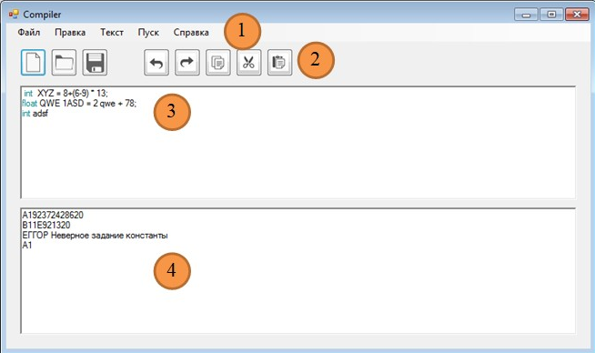

На рисунке обозначены:  
① — основное меню программы  
② — панель инструментов  
③ — область ввода/редактирования текста  
④ — область отображения результатов (ввод запрещён)

### Основное меню (①)

- **Файл** — Создать, Открыть, Сохранить, Сохранить как, Выход  
- **Правка** — Отменить, Повторить, Вырезать, Копировать, Вставить  
- **Вид** — Увеличить шрифт, Уменьшить шрифт  
- **Текст** — Постановка задачи, Грамматика, Классификация грамматики, Методология анализа, Тестовый пример, Список литературы, Исходный код программы  
- **Пуск** — Запуск синтаксического анализатора  
- **Справка** — Справка, О программе  
- **Язык** — Русский / English (дополнительная функция локализации)

### Панель инструментов (②)

Панель содержит кнопки для вызова часто используемых пунктов меню (все 11 пунктов из задания реализованы):

1. Создание документа  
2. Открытие документа  
3. Сохранение текущих изменений в документе  
4. Отмена изменений (Undo)  
5. Повтор последнего изменения (Redo)  
6. Копировать текстовый фрагмент  
7. Вырезать текстовый фрагмент  
8. Вставить текстовый фрагмент  
9. Запуск синтаксического анализатора  
10. Вызов справки — руководства пользователя  
11. Вызов информации о программе


### Область редактирования текста (③)

- Многовкладочный редактор  
- Нумерация строк  
- Подсветка синтаксиса (ключевые слова, строки, комментарии, числа)  
- Подсветка текущей строки  
- Масштабирование шрифта (Ctrl + колесо / Ctrl++ / Ctrl+-)  
- Поддержка Drag & Drop файлов  
- Undo / Redo / Cut / Copy / Paste

### Область результатов (④)

- Две вкладки:  
  • **Результаты** — текстовый вывод (preview кода, сообщения)  
  • **Ошибки** — таблица (Строка | Позиция | Сообщение)  
- В демо-режиме выводятся примеры ошибок  
- Ввод текста запрещён

## Реализованные дополнительные возможности

- Локализация интерфейса (русский / английский)  
- Статусная строка: позиция курсора, кодировка (UTF-8), режим (Вставка/Замена), кол-во символов и слов  
- Подтверждение сохранения при закрытии изменённых вкладок  
- Сплиттер для изменения размеров областей  
- Автоматическая адаптация при изменении размера окна

## Скриншоты реализованного приложения

### Главное окно (русский язык)

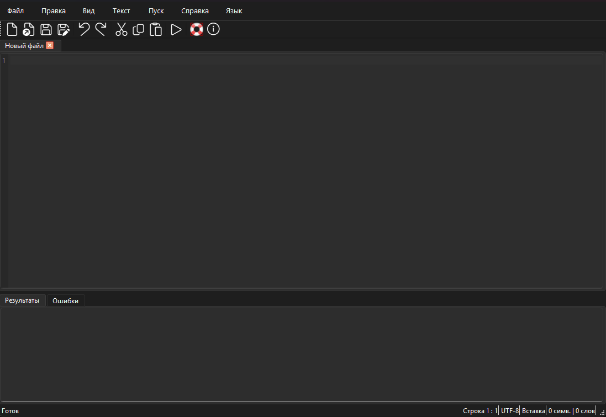

### Главное окно (английский язык)

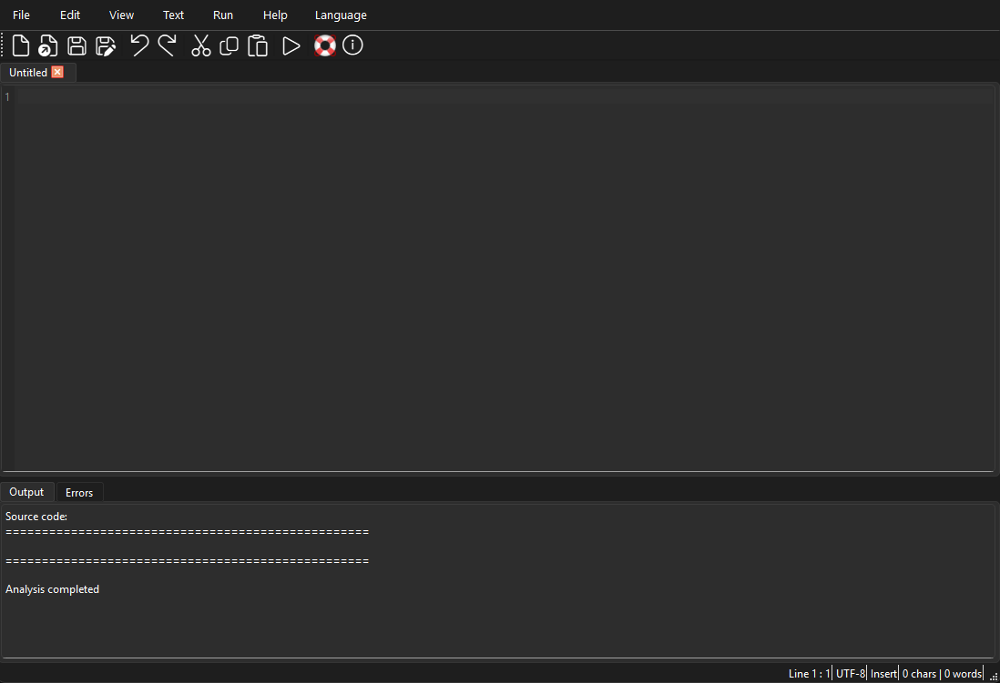

### Панель инструментов и меню

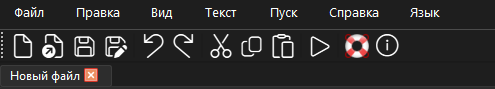

### Область результатов и ошибок

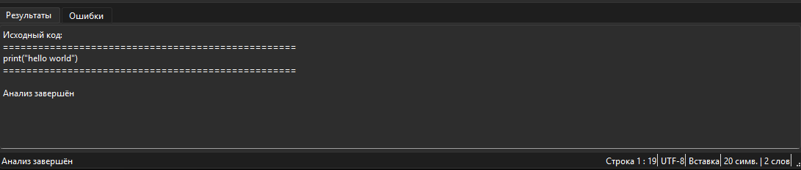

### Статусная строка

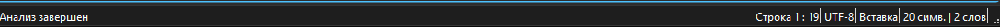

### Диалог «О программе»

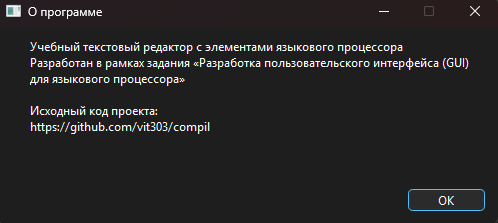

## Установка и запуск

### Требования

- Python 3.8+  
- PyQt6


pip install PyQt6

## Горячие клавиши

| Действие                  | Комбинация       |
|---------------------------|------------------|
| Новый файл                | Ctrl+N          |
| Открыть                   | Ctrl+O          |
| Сохранить                 | Ctrl+S          |
| Сохранить как             | Ctrl+Shift+S    |
| Отменить                  | Ctrl+Z          |
| Повторить                 | Ctrl+Y          |
| Вырезать                  | Ctrl+X          |
| Копировать                | Ctrl+C          |
| Вставить                  | Ctrl+V          |
| Запустить анализ          | F5              |
| Увеличить шрифт           | Ctrl++          |
| Уменьшить шрифт           | Ctrl+-          |

## Структура проекта

\```
.
├── main.py                     # точка входа
├── app/
│   ├── __init__.py
│   ├── main_window.py          # главное окно, меню, тулбар, статусбар
│   ├── editor_tab.py           # редактор + нумерация строк
│   ├── output_tab.py           # вкладки Результаты и Ошибки
│   ├── syntax_highlighter.py   # подсветка синтаксиса
│   ├── dialogs.py              # диалоги
│   └── i18n.py                 # локализация
└── screenshots/                # скриншоты

\```
Разработан лексический анализатор для структур в Rust (ключевые слова сужены под объявления `struct`).  
Синтаксический анализатор разбирает только объявления структур (`struct` / `pub struct`).  
Интегрирован в GUI из ЛР1.  
Вывод: таблица лексем ("Результаты") + таблица ошибок ("Ошибки").  
Навигация по ошибкам реализована.

### Допустимые лексемы
| Код | Тип лексемы     | Примеры                  |
|-----|-----------------|--------------------------|
| 14  | ключевое слово  | `struct`, `pub`, примитивы (`i32`, `u64`, `String`...) |
| 2   | идентификатор   | `Point`, `x`, `width`    |
| 1   | число           | `123`, `-4.5`            |
| 5   | строка          | `"hello"`, `'c'`         |
| 10  | оператор        | `=`, `->`, `+`, `==`     |
| 16  | разделитель     | `{`, `}`, `,`, `;`       |
| 11  | разделитель     | пробел, `\n`             |
| 8   | комментарий     | `// ...`, `/* ... */`    |

### Диаграмма состояний конечного автомата
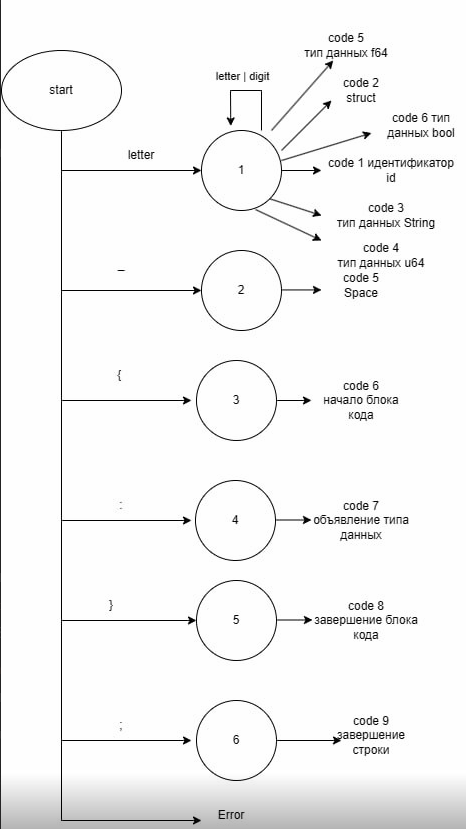  

Краткое описание: Автомат сканирует текст слева направо, накапливая лексемы. Многострочность учитывается через счётчик строк. Ошибки фиксируются в реальном времени.

### Тестовые примеры

#### 1. Корректный (однострочный)
**Вход:** `struct Point { x: i32, y: i32 }`

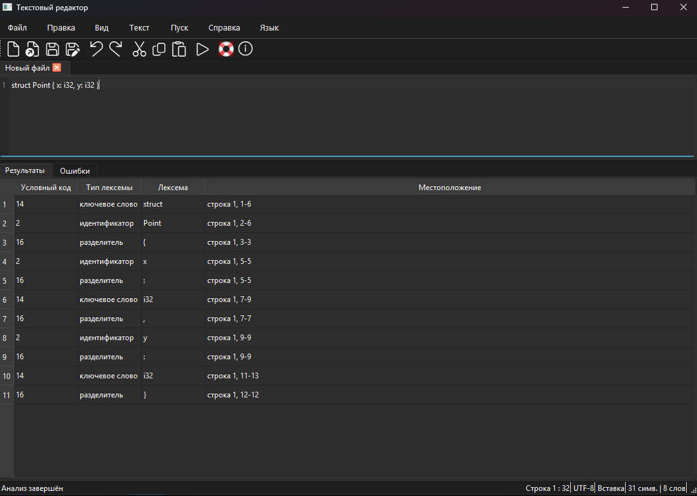

#### 2. С ошибкой
**Вход:** `struct Point { x: i32@ }`  
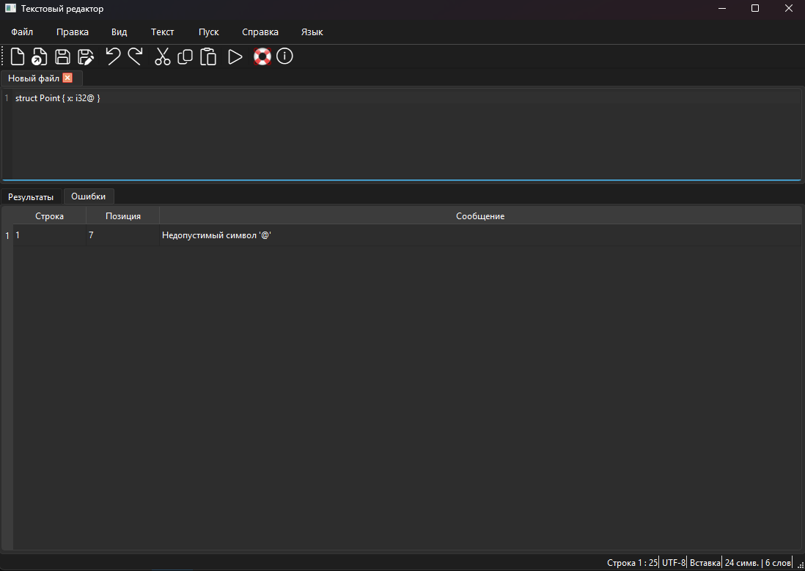


## Синтаксический анализатор (парсер)

### Цель работы (ЛР3)

Изучить назначение и принципы работы синтаксического анализатора в структуре компилятора. Спроектировать грамматику для заданной синтаксической конструкции (объявление структуры в стиле Rust), построить схему метода анализа, выполнить программную реализацию парсера с нейтрализацией синтаксических ошибок методом Айронса. Интегрировать модуль в ранее созданный GUI.

### Постановка задачи (ЛР3)

- Разработать грамматику для объявления структуры (`struct`).
- Построить схему метода анализа (рекурсивный спуск / автоматная грамматика).
- Реализовать парсер с восстановлением после ошибок (метод Айронса).
- Входные данные — строка из области редактирования.
- Выходные данные:
  - При успехе: сообщение об отсутствии ошибок.
  - При ошибках: таблица с колонками *Неверный фрагмент*, *Местоположение (строка, позиция)*, *Описание ошибки*.
- Интеграция: кнопка «Пуск» (или отдельная кнопка) запускает синтаксический анализ.
- Навигация: клик по строке таблицы ошибок → курсор в редакторе устанавливается на позицию ошибки.

## Вариант задания 11
Объявление и определение структуры на языке Rust

Корректные примеры строк:

```
struct Student {
    name: String,
    roll: u64,
    dept: String
};

```

```
struct Point {
    x : f64,
    y : f64
};

```
```
struct Product {
    name: String,
    id: u64,
    price: f64,
    category: String,
    in_stock: bool
};
```
### Перечень допустимых лексем
```
struct, bool, char, str, String,
i8, i16, i32, i64, i128, isize,
u8, u16, u32, u64, u128, usize,
f32, f64
```

### Разработанная грамматика
```
1) <START> -> 'struct' <SPACE>
2) <SPACE> -> ' ' <NAME_STRUCT>
3) <NAME_STRUCT> -> letter <NAME_STRUCT_REM>
4) <NAME_STRUCT_REM> -> letter <NAME_STRUCT_REM> | digit <NAME_STRUCT_REM> | '_' <NAME_STRUCT_REM> | '{' <BODY>
5) <BODY> -> letter <ID>
6) <ID> -> letter <ID> | digit <ID> | '_' <ID> | ':' <TYPE>
7) <TYPE> -> 'String' <END_FIELD> | 'u64' <END_FIELD> | 'char' <END_FIELD> | 'f64' <END_FIELD> | 'bool' <END_FIELD>
8) <END_FIELD> -> ',' <BODY> | '}' <END_BODY>
9) <END_BODY> -> ';'
```

Следуя введенному формальному определению грамматики, представим G[‹START›] ее составляющими:

```
Z = ‹START ›;
VT = { a, b, c, ..., z, A, B, C, ..., Z, 0, 1, 2, ..., 9, _, {, }, :, ,, ;, _};
VN = {<START>, <SPACE>, <NAME_STRUCT>, <NAME_STRUCT_REM>, <BODY>, <ID>, <TYPE>, <END_FIELD>, <END_BODY>}.
```

Согласно классификации Хомского, грамматика G[‹START›] является автоматной.
Правила (1)-(9) относятся к классу праворекурсивных продукций (A → aB | a | ε)

### Граф автоматной грамматики

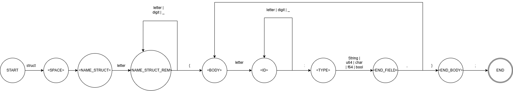

## Метод Айронса для автоматной грамматики

Разрабатываемый синтаксический анализатор построен на базе автоматной грамматики. Реализация алгоритма Айронса для автоматной грамматики имеет следующую особенность.
Дерево разбора с использованием автоматной грамматики представлено на рисунке.

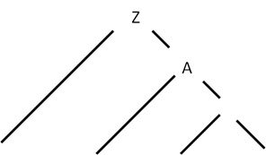

Таким образом, при возникновении синтаксической ошибки в процессе разбора с использованием автоматной грамматики, в дереве разбора всегда будет только один недостроенный куст.

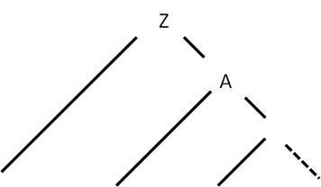

Поскольку единственный недостроенный куст – это тот, во время построения которого возникла синтаксическая ошибка, то это единственный куст, к которому можно привязать оставшуюся входную цепочку символов.
Алгоритм нейтрализации был сведен к последовательному удалению следующего символа во входной цепочке до тех пор, пока следующий символ не окажется одним из допустимых в данный момент разбора.


## Вариант задания (синтаксис)

**Конструкция:** объявление структуры в стиле Rust.

## Тесты
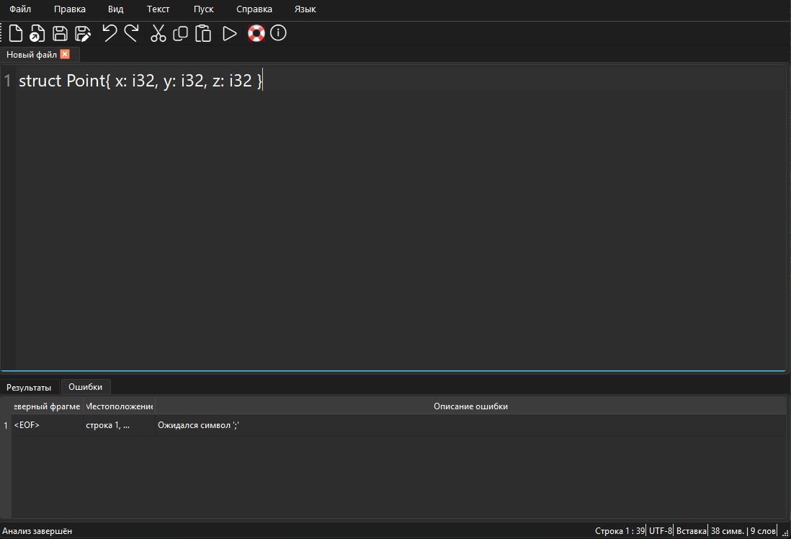
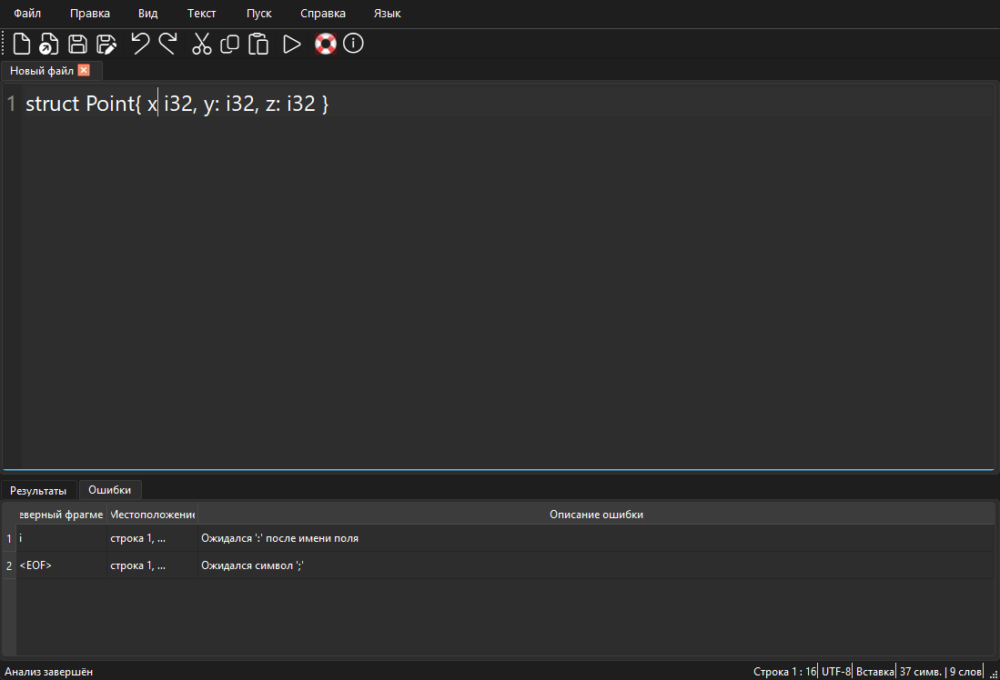
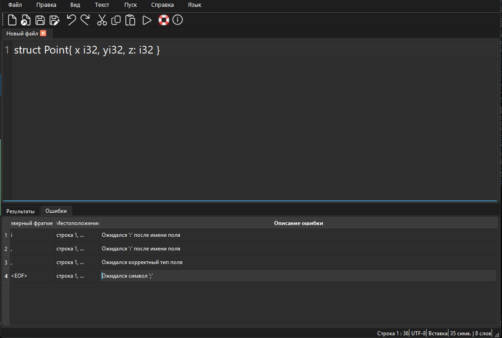

## Тест со множеством ошибок

### Правильный вариант

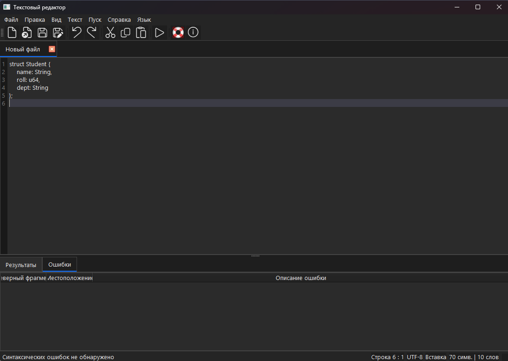

### Вариант с 10 ошибками

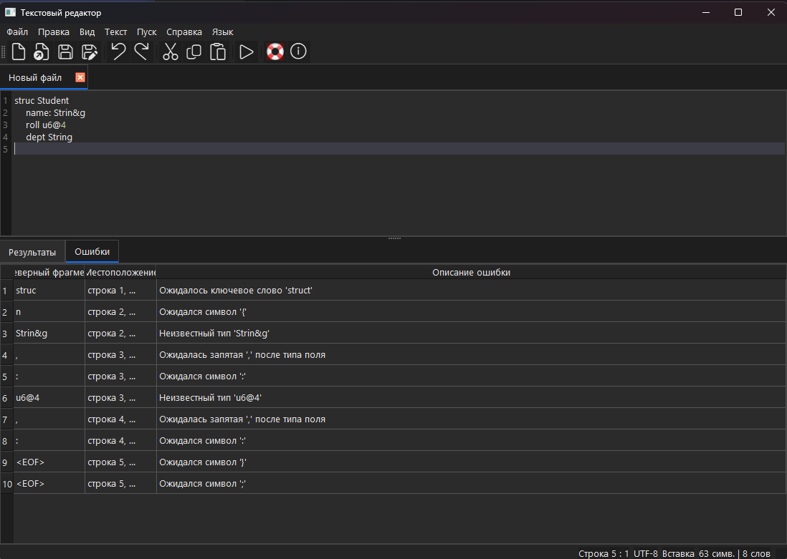

---

# Лабораторная работа 7. Преобразование и анализ кода с использованием Clang и LLVM

**Автор:** Зоркольцев Илья Алексеевич (укажите группу при сдаче)  
**Вариант:** 2.2 — структуры / записи (передача `struct Point` в функцию `sum`)  
**Интерфейс:** тот же GUI, что в ЛР1–5 (PyQt6), расширен вкладкой **LLVM / IR** и пунктами меню **Пуск**.

## Постановка задачи

### Общее задание

1. Установить Clang, LLVM, `opt` и Graphviz.  
2. Получить **AST** для C/C++-файла.  
3. Сгенерировать **LLVM IR** без оптимизаций (`-O0`) и с оптимизациями (`-O2`).  
4. Применить оптимизации через **`opt`** и сравнить с IR от Clang.  
5. Построить **CFG** для функций программы.  
6. Сформулировать выводы и ответить на контрольные вопросы.

### Индивидуальное задание (вариант «структуры»)

Исследовать передачу структуры `struct Point` в функцию `sum`:

1. Получить AST и LLVM IR.  
2. Применить `-O2` и описать, изменилась ли передача структуры (по значению / по ссылке).  
3. Построить CFG для `sum` и `main`.  
4. Исследовать версию с `__attribute__((always_inline))` у `sum`.  
5. Вывод: как LLVM оптимизирует передачу структур?

Исходники:

- `examples/lab7/struct_pass.c` — основной пример варианта  
- `examples/lab7/struct_pass_inline.c` — с `always_inline`  
- `examples/lab7/main.c` — простой пример из методички (`square` / `main`)

## Установка среды

### Ubuntu / Debian

```bash
sudo apt install clang llvm graphviz
clang --version
opt --version
dot -V
```

### Windows

1. Установить [LLVM](https://releases.llvm.org/) (в PATH должны быть `clang` и `opt`).  
2. Установить [Graphviz](https://graphviz.org/download/) (`dot` в PATH).  
3. Перезапустить терминал и GUI-приложение.

## Запуск GUI

```bash
pip install -r requirements.txt
python main.py
```

**Пуск → Открыть пример struct_pass.c** — загружает файл варианта.  
**F5** — для C-файлов запускает полный анализ LLVM (AST, IR -O0/-O2, `opt`, CFG, отчёт по структурам).  
Для Rust-грамматики `struct` (ЛР3–5) **F5** по-прежнему запускает лексический/синтаксический анализ.

Результаты:

| Вкладка       | Содержимое                                      |
|---------------|-------------------------------------------------|
| **LLVM / IR** | AST, IR, анализ передачи struct, список CFG     |
| **Ошибки**    | Сообщения, если не найден `clang`/`opt` и т.д.  |
| **Результаты**| Таблица лексем (режим Rust)                     |

## Общее задание (выполнение)

### 1. AST

```bash
clang -Xclang -ast-dump -fsyntax-only -std=c11 examples/lab7/main.c
```

В GUI выводится в разделе `=== AST ===`.

### 2. LLVM IR (-O0 и -O2)

```bash
clang -O0 -S -emit-llvm -std=c11 examples/lab7/main.c -o main_O0.ll
clang -O2 -S -emit-llvm -std=c11 examples/lab7/main.c -o main_O2.ll
```

При **-O0**: много `alloca`, `load`/`store`, отдельные функции.  
При **-O2**: для `main.c` функция `square` часто **встраивается** и **сворачивается** в константу `25`; `alloca` исчезают (**mem2reg**, **DCE**).

### 3. Оптимизация IR через opt

```bash
clang -O0 -S -emit-llvm -std=c11 examples/lab7/main.c -o main_O0.ll
opt -passes=default<O2> main_O0.ll -S -o main_opt.ll
```

В GUI: раздел `=== LLVM IR (opt -passes=default<O2>) ===`.

### 4. CFG

```bash
clang -O2 -S -emit-llvm -std=c11 examples/lab7/struct_pass.c -o struct.ll
opt -passes=dot-cfg -disable-output struct.ll
dot -Tpng .main.dot -o cfg_main.png
dot -Tpng .sum.dot -o cfg_sum.png
```

В GUI перечисляются созданные `.dot` / `.png` (во временной папке при анализе из редактора).

## Индивидуальное задание: передача структур

### Исходный код (`struct_pass.c`)

См. `examples/lab7/struct_pass.c`.

### 1. AST и IR

Команды аналогичны общей части; в GUI — **F5** на открытом `struct_pass.c`.

### 2. Передача при -O0 и -O2

**-O0:** в IR обычно видны:

- тип `%struct.Point`, размещение на стеке через `alloca`;
- параметр функции `sum` — часто `%"struct.Point"*` с атрибутом **`byval`** (семантика передачи **по значению** на уровне ABI: копия для вызываемой функции);
- обращения к полям через `getelementptr`, `load`, `store`;
- вызов `call @sum(...)`.

**-O2** (аргументы `{2, 3}` известны на этапе компиляции):

- вызов `@sum` **исчезает** (inlining + constant folding);
- в `main` остаётся, как правило, прямой вывод `5` через `printf`;
- отдельная передача структуры как аргумента **не нужна** — оптимизатор устранил её.

**Ответ на вопрос «по значению / по ссылке?»:** в исходном C — **по значению**. В LLVM при -O0 это отражается как **`byval`** или копирование через стек; это **не** передача «по ссылке» в смысле C++ reference, хотя в IR используется указатель на копию. При -O2 для данного примера передача **исчезает** из-за оптимизаций.

### 3. CFG для `sum` и `main`

При **-O0** — два CFG: `.sum.dot` и `.main.dot`.  
При **-O2** — CFG для `sum` может **не создаться**, если функция удалена/встроена.

### 4. `__attribute__((always_inline))`

Файл: `examples/lab7/struct_pass_inline.c`.

```bash
clang -O2 -S -emit-llvm -std=c11 examples/lab7/struct_pass_inline.c -o inline_O2.ll
```

Атрибут `alwaysinline` заставляет компилятор **встраивать** `sum` даже при агрессивных эвристиках. Для константного `p = {2,3}` результат сопоставим с обычным `-O2`: вызов исчезает, остаётся упрощённый `main`.

### 5. Вывод по индивидуальному заданию

LLVM не меняет семантику C «по значению» на «по ссылке», а представляет копирование через **byval** / стек / регистры (ABI). Оптимизации **-O2** (`inline`, `constprop`, `mem2reg`, `SROA`, `DCE`) могут:

- разложить структуру на скаляры в регистрах;
- встроить маленькую функцию и убрать вызов;
- полностью убрать передачу struct, если аргументы известны как константы.

## Выводы: контрольные вопросы

1. **Clang** — фронтенд компилятора (парсинг, AST, семантика, генерация IR); часто используется как библиотека для анализа и IDE.  
2. **LLVM** — набор библиотек и IR для оптимизации и генерации кода; backend-ы для разных платформ.  
3. **AST** отражает синтаксическую структуру исходника; **IR** — низкоуровневые инструкции, SSA, близко к машине.  
4. **IR** нужен для переносимых оптимизаций и единого pipeline независимо от языка.  
5. **`alloca`** выделяет память на стеке в IR; до **mem2reg** переменные часто живут в памяти.  
6. **Оптимизация** ускоряет код, уменьшает размер, убирает лишние операции при сохранении семантики.  
7. **SSA** — каждое значение присваивается один раз; упрощает анализ потоков данных и оптимизации.  
8. **CFG** — граф базовых блоков и переходов; нужен для анализа путей, циклов, оптимизаций.  
9. Арифметика в IR: типизированные инструкции `add`, `mul`, `fadd` и т.д. для целых/вещественных.  
10. Функции — естиницы с отдельным CFG, своим набором оптимизаций и ABI.  
11. Короткая функция с одним вызовом часто **встраивается** (`inline`) и может быть удалена.  
12. IR и CFG дают формальную структуру для автоматических преобразований; исходный текст C сложнее и неоднозначнее для таких проходов.

## Структура проекта (дополнение ЛР7)

```
examples/lab7/
  main.c                 # общий пример
  struct_pass.c          # вариант: struct
  struct_pass_inline.c   # always_inline
app/
  clang_llvm.py          # вызов clang/opt, анализ struct
  c_syntax_highlighter.py
```

## Ручные команды (без GUI)

См. разделы выше; все команды дублируются в логе GUI (`=== Выполненные команды ===`).